# Hệ Thống Quản Lý Trung Tâm Sửa Chữa Xe

Nền tảng quản trị toàn diện dành cho **trung tâm sửa chữa xe**, tích hợp **E-commerce** và hệ thống theo dõi trạng thái dịch vụ

---
## Mục lục
- [Giới thiệu](#giới-thiệu)
- [Các tính năng chính](#các-tính-năng-chính)
- [Quy trình nghiệp vụ](#quy-trình-nghiệp-vụ)
- [Công nghệ sử dụng](#công-nghệ-sử-dụng)
- [Lược đồ](#lược-đồ-cơ-sở-dữ-liệu)
- [Hướng dẫn cài đặt](#hướng-dẫn-cài-đặt)
- [Danh sách tài khoản demo](#danh-sách-tài-khoản-demo)
- [Hình ảnh minh hoạ](#hình-ảnh-minh-hoạ)
- [Web triển khai](#web-đã-được-triển-khai-tại)

---

## Giới thiệu

Hệ thống giúp:
- Quản lý toàn bộ quy trình sửa chữa xe  
- Bán phụ tùng trực tuyến  
- Theo dõi trạng thái sửa chữa
- Thanh toán online (Momo, VNPAY)
- Quản lý nhân sự, kho và doanh thu

---

## Các tính năng chính

### Phân hệ Khách hàng

- **Thương mại điện tử**
  - Xem danh mục sản phẩm & dịch vụ
  - Giỏ hàng, mua phụ tùng và thanh toán trực tuyến
  - Bình luận, đánh giá sản phẩm  

- **Đặt lịch trực tuyến**
  - Chủ động đặt lịch sửa chữa  
  - Theo dõi trạng thái:
    ```
    Đặt lịch -> Tiếp nhận -> Đang sửa -> Hoàn thành
    ```

- **Thanh toán đa phương thức**
  - Thanh toán qua:
    - Momo  
    - VNPAY  
    - Tiền mặt  

- **Quản lý tài khoản**
  - Đăng ký / đăng nhập  
  - Reset mật khẩu qua Email

- **Số hóa hóa đơn**
  - Xem lịch sử thanh toán  
  - In hóa đơn trực tiếp từ web  

---

### Phân hệ Quản trị

- **Quản trị nhân sự**
  - Quản lý tài khoản nhân viên  
  - Phân quyền truy cập  
  - Quản lý thông tin khách hàng  

- **Vận hành sửa chữa**
  - Xác nhận lịch đặt  
  - Lập **Phiếu tiếp nhận** từ lịch hẹn  
  - Lập **Phiếu sửa chữa** và báo giá  
  - Cập nhật trạng thái sửa chữa  

- **Tài chính & Kho**
  - Tự động xuất hóa đơn  
  - Trừ tồn kho phụ tùng  
  - Thống kê doanh thu  

---

## Quy trình nghiệp vụ

1. **Đặt lịch**  
   Khách hàng đặt lịch trên website  

2. **Tiếp nhận**  
   Admin xác nhận -> tạo Phiếu tiếp nhận  

3. **Báo giá**  
   Kỹ thuật kiểm tra -> lập Phiếu sửa chữa -> gửi báo giá  

4. **Thực hiện**  
   Khách đồng ý -> chuyển trạng thái "Đang sửa"  

5. **Thanh toán**  
   Chọn phương thức:
   - Tiền mặt  
   - Momo  
   - VNPAY  

6. **Hoàn tất**  
   - Cập nhật doanh thu  
   - Trừ kho  
   - Xuất hóa đơn  

---

## Công nghệ sử dụng

- **Backend:** Flask 
- **Frontend:** Jinja2, HTML5, CSS3, JavaScript  
- **Database:** MySQL
- **Integration:**
  - Momo API  
  - VNPAY Sandbox  
  - Flask-Mail 


---
## Lược đồ cơ sở dữ liệu
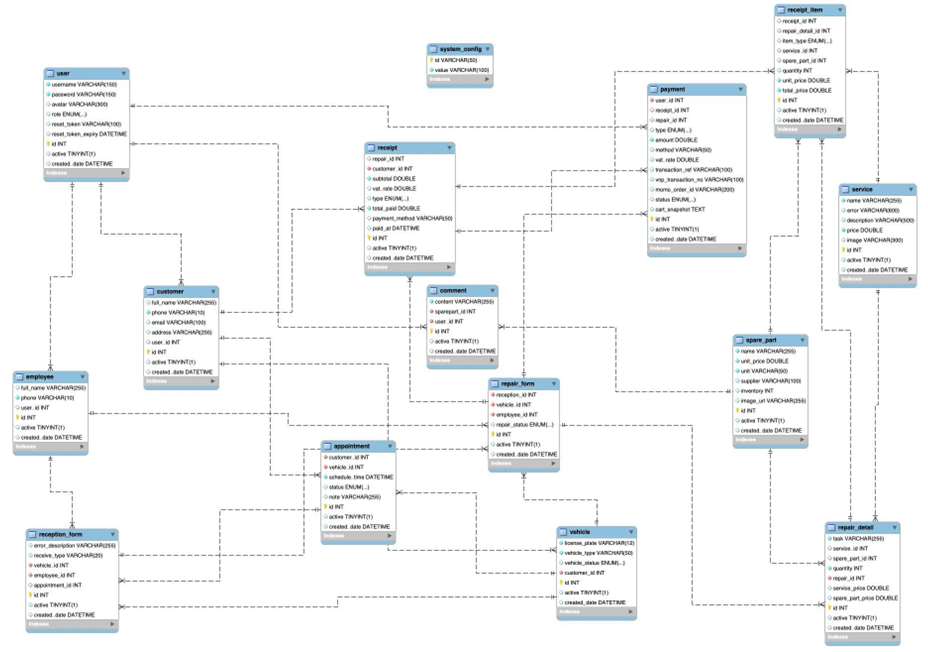

## Lược đồ UseCase tổng quát
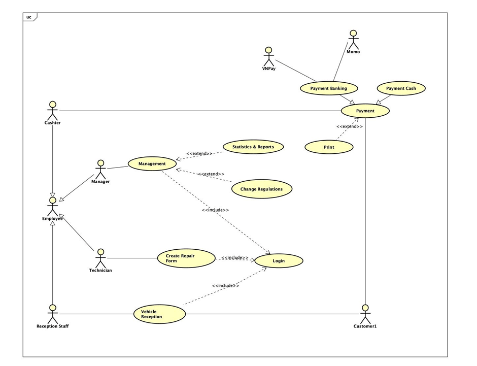
## Hướng dẫn cài đặt

### 1. Clone dự án

```bash
git clone https://github.com/pgiahuy/cnpm-trung-tam-sua-xe.git
cd cnpm-trung-tam-sua-xe
```
### 2. Tạo môi trường ảo
```
python -m venv venv
```
Windows:
```
venv\Scripts\activate
```
Linux / MacOS:
```
source venv/bin/activate
```
### 3. Cài đặt thư viện
```
pip install -r requirements.txt
```
### 4. Cấu hình hệ thống

- Tạo database 'garage' trong MySQL

5. Khởi chạy ứng dụng
```
python index.py
```
Truy cập:
```
http://127.0.0.1:5000
```
---
## Web đã được triển khai tại:
```
https://giahuy123.pythonanywhere.com/
```

---
## Danh sách tài khoản demo
> Vui lòng không thay đổi các dữ liệu mẫu

| Vai trò        | Username             | Password |
|---------------|----------------------|----------|
| Admin     | `admin`              | `123`    |
| Khách hàng | `huy`                | `123`    |
| Khách hàng | `Có thể đăng ký mới` |          |

---
## Hình ảnh minh hoạ

### Quản trị

<table>
<tr>
<td align="center">
<b>Trang chủ quản trị</b><br>
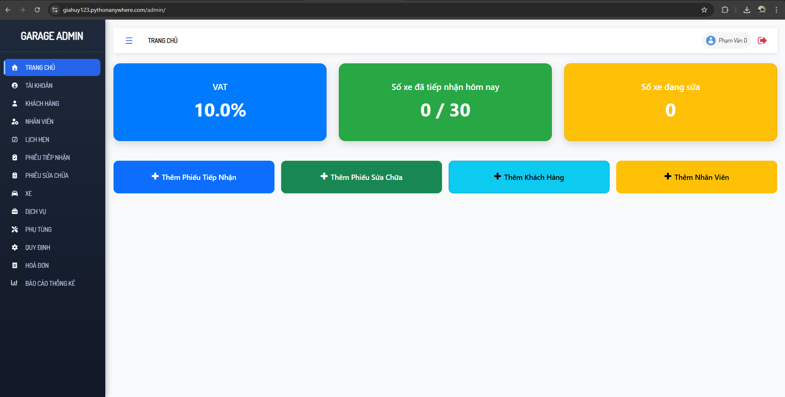
</td>

<td align="center">
<b>Quản lý khách hàng</b><br>
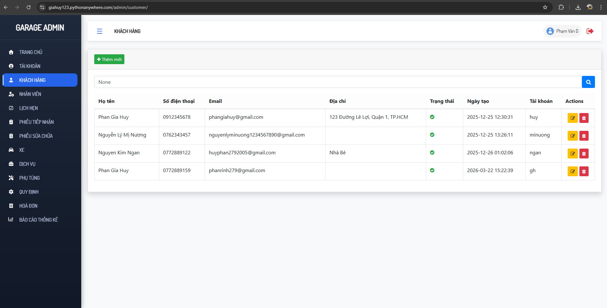
</td>
</tr>

<tr>
<td align="center">
<b>Quản lý phiếu sửa chữa</b><br>
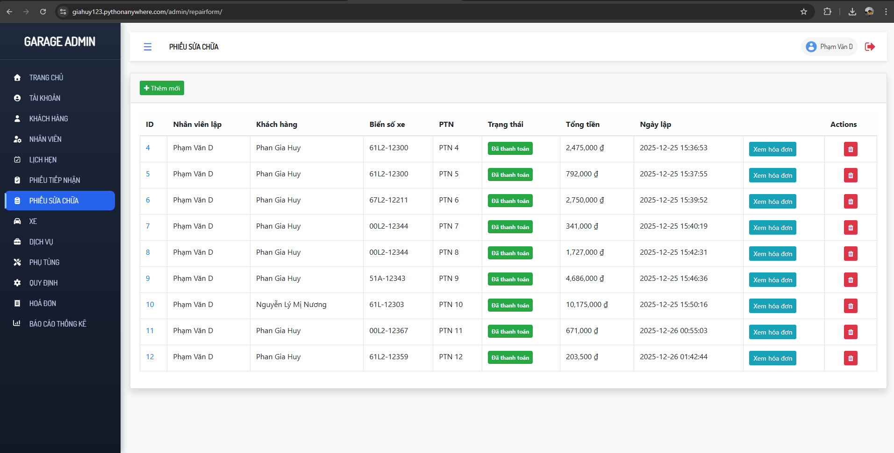
</td>

<td align="center">
<b>Quản lý xe</b><br>
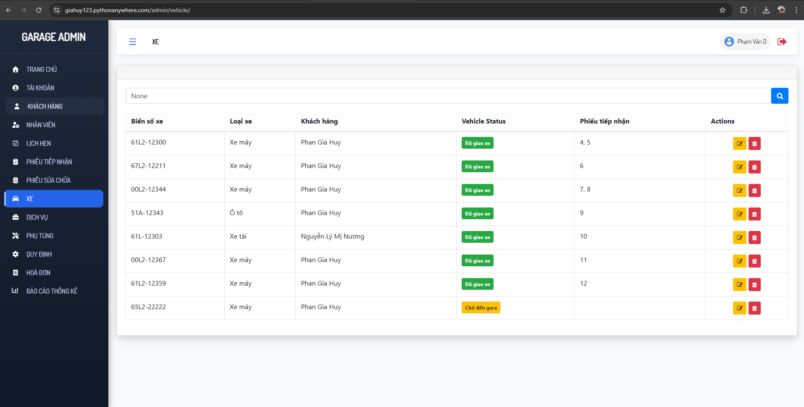
</td>
</tr>

<tr>
<td align="center">
<b>Thanh toán tại cửa hàng</b><br>
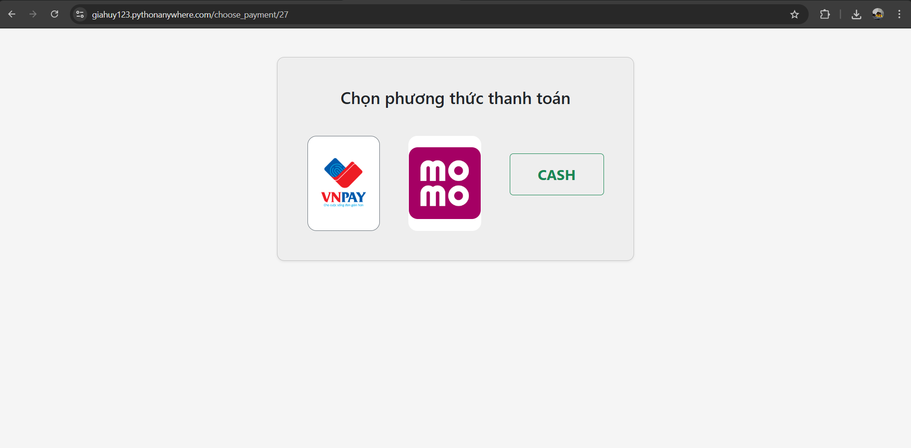
</td>

<td align="center">
<b>Thanh toán MOMO</b><br>
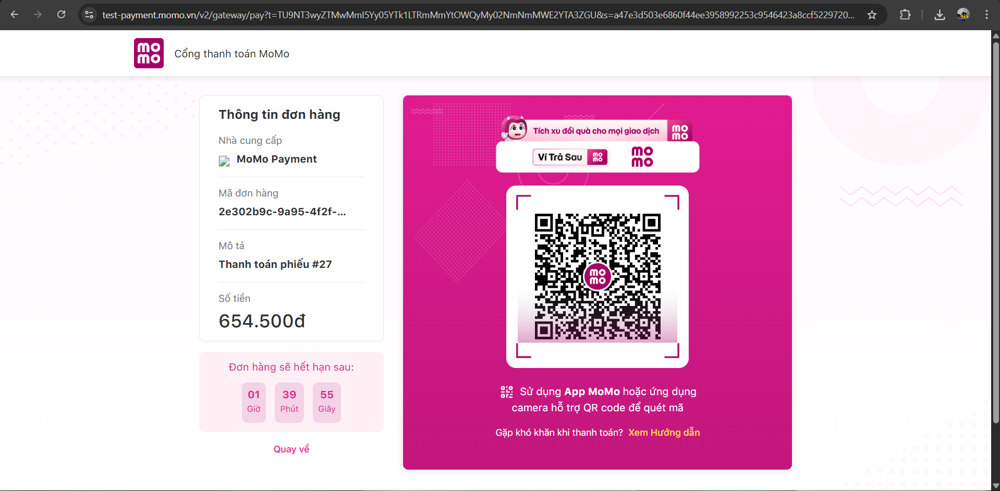
</td>
</tr>

<tr>
<td align="center">
<b>Xem phiếu sửa chữa</b><br>
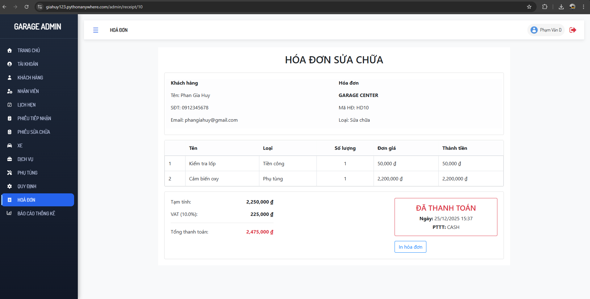
</td>


</table>


## Khách hàng


<table>

<tr>
<td align="center">
<b>Trang chủ</b><br>
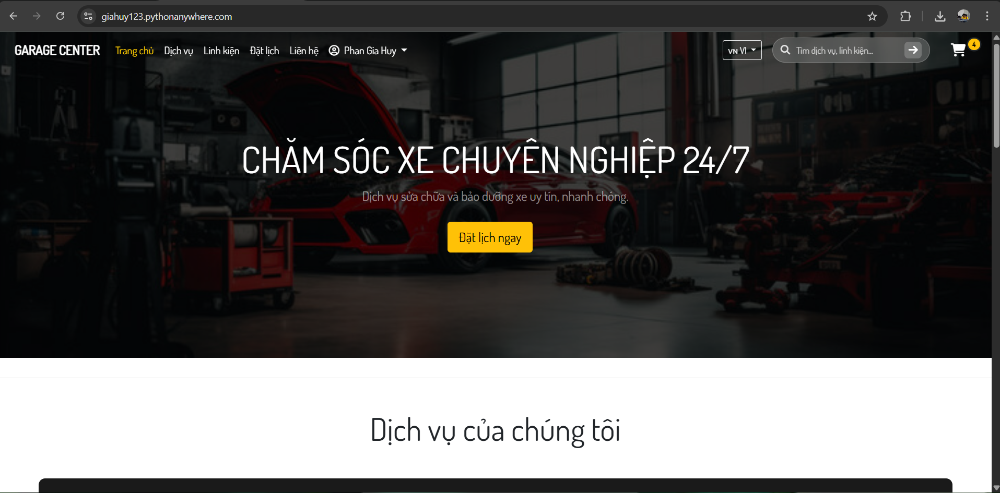
</td>

<td align="center">

<b>Xem lại hoá đơn thanh toán</b><br>
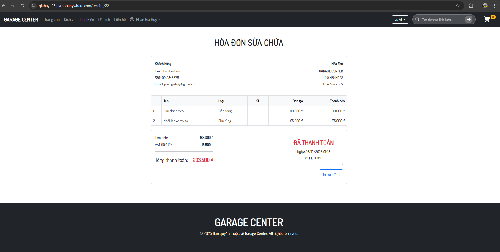
</td>
</tr>


<tr>
<td align="center">
<b>Theo dõi tình trạng xe</b><br>
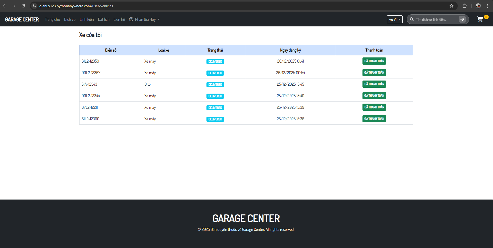
</td>

<td align="center">
<b>Xem lịch sử thanh toán</b><br>
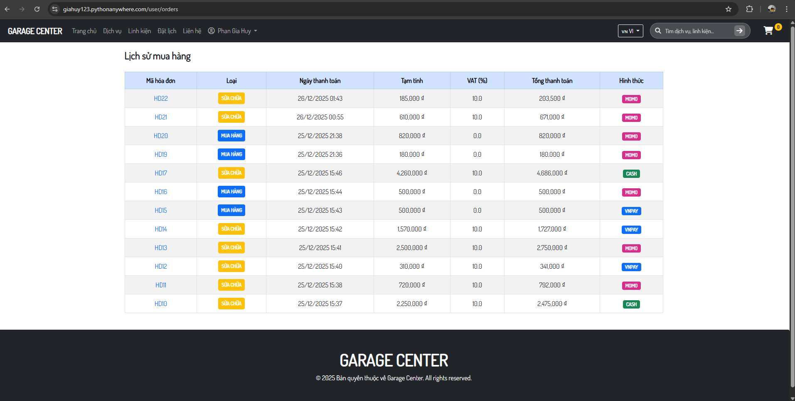
</td>
</tr>


</table>


---
## Danh sách thành viên

- Phan Gia Huy
- Nguyễn Lý Mị Nương
- Nguyễn Lý Kim Ngân

> Lưu ý: Các thông tin cấu hình chỉ là dữ liệu mẫu và không có giá trị sử dụng thực tế